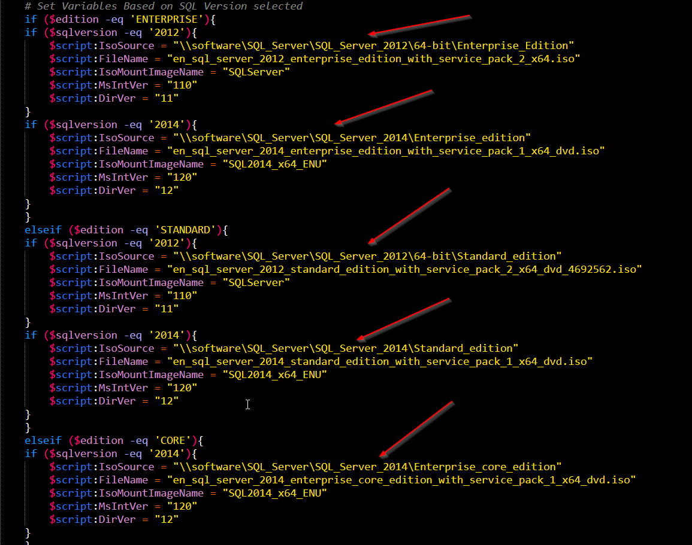

PowerShell script used to install different version of SQL Server (2012 or 2014).

This script will execute in the following order
- Checks if current user is "ssadmin" and if "D,E,T,L" Drive letters are present
- Ask for user input for following
     - SQL Version
     - SQL Edition
     - Instance Name
     - Collation
     - TCP Port #
     - Max Memory to allocate to instance
     - SQL Server components to install
     - "ssadmin" password (Password not displayed)
     - SA password
- Copy over appropriate ISO files and mounts it
- Start installing SQL Server
- Change Max Memory allocated to newly created instance
- Disable dynamic port and Enable Static port(Port provided by user-input)
     - If instance type is Default(MSSQLSERVER) then named pipes are enabled
- Change/Creates following
     - Changes Recovery Model to SIMPLE
     - Change Model mdf file to 10MB and auto growth of 250MB
     - Change Model ldf file to 10MB and auto growth of 100MB
     - Changes Log Rotations to 30 Logs
     - Creates "DBA_management" database
     - Create Monitoruser account
     - Creates index rebuilds stored procedure
     - Creates a new SQL Server job for index rebuild (Runs weekly on Sunday 6PM Server time)
- Restart SQL Server
- Dismounts ISO, Remove ISO

Requirement:
- We need to have D,E,T,L Drive present.  D drive is used for installation, E is Data, T is Temp, L is Log/ldf files
- User running this script should be "ssadmin" (or change it appropriately)
- Have a network drive of "//software" (or change it appropriately)
- Need to have ISO files at appropriate directory's as show in below 

- copy AutomaticIndexRebuildJob.sql, mon_user.sql, index_defrag.sql file to "\\software\SQLServer\AutomaticIndexRebuild"

